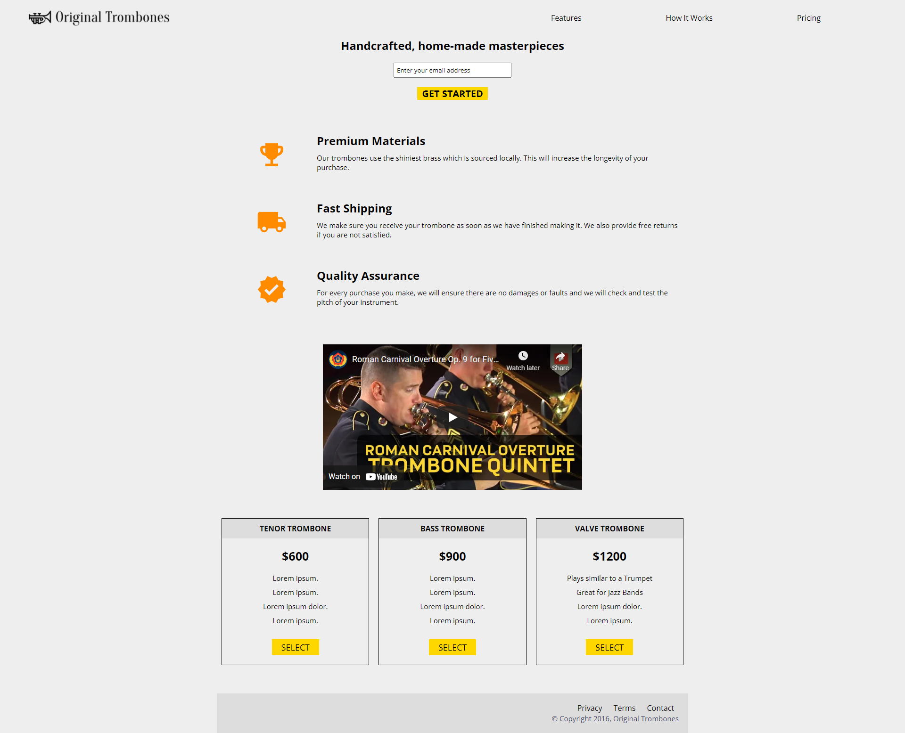

# Kolehiyolo | freeCodeCamp | Build a Product Landing Page
Welcome! I am a budding coder and this is my submission to the 'Build a Product Landing Page' project from freeCodeCamp.

## Table of contents
- [Overview](#overview)
  - [Summary](#summary)
  - [The Challenge](#the-challenge)
  - [Screenshots](#screenshots)
  - [Links](#links)
- [My Process](#my-process)
  - [Built With](#built-with)
  - [What I Learned](#what-i-learned)
  - [Continued Development](#continued-development)
  - [Useful Resources](#useful-resources)
- [Author](#author)
- [Acknowledgments](#acknowledgments)

## Overview
### Summary
This sample project was fun in the sense that there's so much variety in the components to be built. The header is fixed, the form is a columned flexbox, the features section looks like a grid, there's an embedded YouTube video that's supposed to be responsive, and the pricing is also quite demanding. Even the footer is unique with the align-right situation. To sum up, this project took a lot in terms of flexing my CSS understanding.

### The Challenge
- Perfectly mimic the sample page from [CodePen](https://codepen.io/freeCodeCamp/full/RKRbwL)
- Make sure to follow the user stories dictated by freeCodeCamp
- Build it while ensuring accessibility and responsive-ness

### Screenshots

  
  
  

### Links
- freeCodeCamp Challenge: [freeCodeCamp | Build a Product Landing Page](https://www.freecodecamp.org/learn/responsive-web-design/responsive-web-design-projects/build-a-product-landing-page)
- Sample: [CodePen](https://codepen.io/freeCodeCamp/full/RKRbwL)
- Solution URL: [GitHub Repo](https://github.com/kolehiyolo/freecodecamp--build_a_product_landing_page)
- Live Site URL (Static): [Kolehiyolo | freeCodeCamp | Build a Product Landing Page (Static)](https://kolehiyolo.github.io/freecodecamp--build_a_product_landing_page/)
- Live Site URL: [Kolehiyolo | freeCodeCamp | Build a Product Landing Page](https://kolehiyolo.github.io/freecodecamp--build_a_product_landing_page/)

## My process
### Built with
- HTML5
- CSS5
- SASS
- Mobile-first workflow

### What I learned
The biggest problem I had to deal with was getting the header to maintain a fixed position while also making sure that the section directly below the header has enough clearance. The simplest solution I came to was just giving the section a padding at the top that adjusts roughly via media-queries. 

Another challenge was the feature section and how I had to deal with the grid. I decided instead to build each feature as a flexbox with the icons with set dimensions. 

I also had to look up styling for the YouTube embed, and I managed with some documentation.

### Continued development
More so than before, I used a lot of flexboxes with this project. From the header, the form, the feature section, the pricing section and the cards and the footer. The flexbox is a surprisingly versatile way of controlling relative element's orientation, spacing, and positions and this power is sublime. I will surely use this more and more.

### Useful resources
- [YouTube Embedding](https://support.google.com/youtube/answer/171780?hl=en) - This is a simple documentation that helped me understand the basics of using the YouTube embedded videos
- [CSS Tricks | A Complete Guide to Flexbox](https://css-tricks.com/snippets/css/a-guide-to-flexbox/) - This absurdly amazing article is one that I continue to go back to despite my relatively extensive experience with flexbox at this point

## Author
- Website - [Add your name here](https://www.your-site.com)
- Frontend Mentor - [@kolehiyolo | Frontend Mentor](https://www.frontendmentor.io/profile/kolehiyolo)
- LinkedIn - [@Tristan Sean Paul Cinco | LinkedIn](https://www.linkedin.com/in/tristan-sean-paul-cinco-8685061a1/)
- GitHub - [@kolehiyolo | Github](https://github.com/kolehiyolo)
- YouTube - [@Tristan Sean Paul Cinco | YouTube](https://www.youtube.com/channel/UCeQfdvq83XLp-eS4vbZZN8Q)
- Facebook - [@Tristan Sean Paul Cinco | Facebook](https://www.facebook.com/tristanseanpaul.cinco.39/)
- Twitter - [@kolehiyolo1221 | Twitter](https://twitter.com/kolehiyolo1221)
- Instagram - [@kolehiyolo | Instagram](https://www.twitter.com/yourusername)

## Acknowledgments
I am severely thankful for discovering [CSS-Tricks](https://css-tricks.com/snippets/css/a-guide-to-flexbox/) which truly opened the door to so much great ways of dealing with CSS. CSS is one of the suckiest areas to work on especially since for a tool that is primarily used for design, there's such difficulty in getting feedback for changes made or why things aren't going the way you want them to. The above site just helps in dealing with that even for a lil bit.